<p align="center">
  <picture>
    <source media="(prefers-color-scheme: dark)" srcset="docs/brand/readme/hero-dark.svg">
    
  </picture>
</p>

<p align="center">
  <b>bise</b> /beez/ · french, n.<br>
  1. a quick kiss on the cheek :*<br>
  2. a brisk north wind<br>
  3. a terminal where multi-agent coding is painless
</p>

<p align="center">
  <a href="https://bise.dev">bise.dev</a> ·
  <a href="#install">install</a> ·
  <a href="#features">features</a> ·
  <a href="https://bise.dev/docs/">docs</a> ·
  <a href="https://bise.dev/book/">brand book</a>
</p>

<br>

**meet your team lead. you stay in flow, it runs the agents.**

bise is a terminal app for multi-agent coding. there's one thread per repo. in it you talk to **main**, an agent that acts as your team lead: it splits your requests into jobs, starts an agent when a job needs one, answers their routine questions, and only comes back to you with the decisions that are yours.

no sessions to juggle and no workflow to set up: the orchestration is built in, and it has opinions.

<p align="center">
  <picture>
    <source media="(prefers-color-scheme: dark)" srcset="docs/brand/readme/demo-b-dark.svg">
    
  </picture>
</p>

more demos and the docs on [bise.dev](https://bise.dev).

## install

```sh
curl -fsSL bise.dev/install | sh
```

then start it in the repo you want to work on:

```sh
cd ~/your-repo
bise
```

the first run walks you through a theme and a model key. `bise doctor` checks your install, your keys and the running hubs.

switching from Claude Code or Codex? paste this into it:

```text
read https://bise.dev/setup.md and set bise up for me
```

your agent installs bise and brings over what you already have: your API key, your model, your `CLAUDE.md`, skills and MCP servers. it shows you one plan and waits for your yes. it never prints a key. if your agent can't open links, paste [the full prompt](https://bise.dev/setup) instead. a Claude Pro/Max or ChatGPT subscription isn't an API key: bise needs a key.

using LiteLLM or another gateway, or any OpenAI-compatible base URL? see [custom providers](docs/custom-providers.md).

> [!NOTE]
> bise is pre-release. **macOS only for now** (Apple silicon and Intel). linux is next.
> bring your own key: Anthropic, OpenAI, Mistral and more.

## how it works

- **one thread per repo.** you always talk to the same thread. it never ends: when it gets long, bise compacts it and keeps going.
- **main is the team lead.** it answers what it can, starts an agent when a job needs one, follows up, and picks up work that stopped half-way.
- **agents work in the background,** in your checkout. they message each other before they touch the same files. one makes a git worktree only when it needs its own copy, and cleans it up after.
- **the inbox holds the decisions that need you.** only the real ones reach you. they wait above your message (`ctrl+1`, or a click), never in the middle of your sentence.

four words to learn: you, main, agents, inbox.

## features

### orchestration

#### long-running goals

give main a large goal. it splits it into jobs, runs agents in parallel, restarts any that stop on an error, and keeps going until the goal is done.

<picture><source media="(prefers-color-scheme: dark)" srcset="docs/brand/readme/feat/resume-dark.svg"></picture>

#### automatic worktrees

agents share your checkout by default. when one needs an isolated copy (a clean build, a risky change), it creates a git worktree, works there, and removes it when it's done. no branches to name, no folders to clean up.

<picture><source media="(prefers-color-scheme: dark)" srcset="docs/brand/readme/feat/worktree-dark.svg"></picture>

### focus

#### main is always available

main hands the heavy work to agents, so it's never busy. ask it anything while five agents run: it listens and answers right away, and nothing you send interrupts a job.

<picture><source media="(prefers-color-scheme: dark)" srcset="docs/brand/readme/feat/talk-dark.svg"></picture>

#### zen mode

while you type, the agents panel, the counters and the agents' chatter dim. they come back when you send. messages between agents stay folded; `ctrl+o` expands them.

<picture><source media="(prefers-color-scheme: dark)" srcset="docs/brand/readme/feat/zen-dark.svg"></picture>

### voice

#### voice to voice

press `ctrl+r` twice for voice mode and just talk to main. it answers out loud while the agents keep working. `space` sends right away, `esc` leaves, and `/voice` picks the model, the voice and the language. the face is drawn in the terminal: it smiles while it listens, turns a * while it thinks, and blows you a kiss when it's done.

<picture><source media="(prefers-color-scheme: dark)" srcset="docs/brand/readme/feat/voicemode-dark.svg"></picture>

#### dictation

set it up with `/voice`, then press `ctrl+r` and talk. your words land in the composer.

<picture><source media="(prefers-color-scheme: dark)" srcset="docs/brand/readme/feat/voice-dark.svg"></picture>

### coordination

#### main answers routine questions

agents ask main, not you. main answers what it can, the way you would, and says why. only the decisions that are yours reach your inbox.

<picture><source media="(prefers-color-scheme: dark)" srcset="docs/brand/readme/feat/card-dark.svg"></picture>

#### agent-to-agent messages

agents message each other directly: questions, hand-offs, who edits which file. these messages are folded in your thread.

<picture><source media="(prefers-color-scheme: dark)" srcset="docs/brand/readme/feat/sync-dark.svg"></picture>

### tools

#### every MCP server, always enabled

connect as many MCP servers as you want (GitHub, Linear, Sentry, Slack, your database) and keep them all on. agents call tools from code, so a hundred servers don't fill the context.

<picture><source media="(prefers-color-scheme: dark)" srcset="docs/brand/readme/feat/tools-dark.svg"></picture>

#### computer use

your agents can use your browser: they open pages in their own tab group, in the background, with your logins, and read, click, type, fill forms and take screenshots. they never take your screen or your active tab. on macOS they can drive apps like Notes or Figma too. it's off by default: `/computer-use` sets it up (the Chrome extension, the permissions, a live test). for now it acts without asking first, so give it the jobs you'd give someone at your desk.

<picture><source media="(prefers-color-scheme: dark)" srcset="docs/brand/readme/feat/computer-dark.svg"></picture>

#### Agent Plugins

skills, MCP servers and hooks in the [Agent Plugins](https://agent-plugins.org) format load as they are, from `~/.agents/plugins` or your repo. Vibe plugins too.

<picture><source media="(prefers-color-scheme: dark)" srcset="docs/brand/readme/feat/plugins-dark.svg"></picture>

### control

#### talk to any agent

`⌥` + a number, or `@name`, talks to one agent directly. ask it why, redirect it, then `⌥0` takes you back to main. the other agents keep running.

<picture><source media="(prefers-color-scheme: dark)" srcset="docs/brand/readme/feat/direct-dark.svg"></picture>

#### pull requests

in a repo that takes pull requests, each change gets its own branch and PR, and goes through your CI, review bots and teammates. the panel shows each PR's state: checks, review, merged.

<picture><source media="(prefers-color-scheme: dark)" srcset="docs/brand/readme/feat/prs-dark.svg"></picture>

## details

small things, done carefully.

#### agents only when needed

main does small jobs itself and starts an agent only when a job needs one. no agents reviewing each other in loops, so fewer tokens.

<picture><source media="(prefers-color-scheme: dark)" srcset="docs/brand/readme/feat/tokens-dark.svg"></picture>

#### images

paste a screenshot with `ctrl+v` or drag it in. it becomes one chip in your message.

<picture><source media="(prefers-color-scheme: dark)" srcset="docs/brand/readme/feat/screenshot-dark.svg"></picture>

#### quotes

select lines in the history and start typing: they're attached to your message as a quote.

<picture><source media="(prefers-color-scheme: dark)" srcset="docs/brand/readme/feat/quote-dark.svg"></picture>

#### a model per agent

a large model for the hard job, a fast one for chores. `/model` and `/reasoning` set them per agent.

<picture><source media="(prefers-color-scheme: dark)" srcset="docs/brand/readme/feat/model-dark.svg"></picture>

#### built-in shell

``ctrl+` `` opens a terminal in your repo. it keeps running while hidden.

<picture><source media="(prefers-color-scheme: dark)" srcset="docs/brand/readme/feat/shell-dark.svg"></picture>

#### restart-safe

update or quit mid-work. agents resume where they stopped, and your thread, your draft and your queued messages come back.

<picture><source media="(prefers-color-scheme: dark)" srcset="docs/brand/readme/feat/restart-dark.svg"></picture>

#### proven message passing

the hub that carries messages between agents is written in [Bend](https://github.com/HigherOrderCO/Bend), with checked proofs that no message is lost or delivered twice (`bend/PROOF.bend`).

<picture><source media="(prefers-color-scheme: dark)" srcset="docs/brand/readme/feat/proof-dark.svg"></picture>

#### your terminal's theme

bise uses your terminal's colors, light or dark, and keeps text at a reading width.

<picture><source media="(prefers-color-scheme: dark)" srcset="docs/brand/readme/feat/theme-dark.svg"></picture>

## from source

```sh
git clone https://github.com/gvergnaud/bise && cd bise
./run.sh    # builds and starts bise in the current folder
```

## what's in here

- [`rust/`](rust/) · the app: the terminal UI, the agent harness, plugins, sessions
- [`bend/`](bend/) · the agent runtime and the Switchboard hub, written in [Bend](https://github.com/HigherOrderCO/Bend), and their laws (`LAWS.bend`, `PROOF.bend`)
- [`prompts/`](prompts/) · the system prompts and tool descriptions the agents read
- [`scripts/`](scripts/) · dev scripts: build the Bend binaries, build and switch versions
- [`docs/`](docs/) · design docs, RFCs, the implementation notes
- [`site/`](site/) · [bise.dev](https://bise.dev), a static site (the installer too)
- [`tests/`](tests/) · the gate (`gate.sh`), e2e and TUI tests
- [`packaging/`](packaging/) · build, install and release scripts
- [`docs/brand/`](docs/brand/) · the brand book, the issue list, these images

## license

Apache-2.0, see [LICENSE](LICENSE). third-party components: [THIRD_PARTY_NOTICES](THIRD_PARTY_NOTICES).

<p align="center"><br>ideas in. little kisses out. also pull requests. :*</p>
